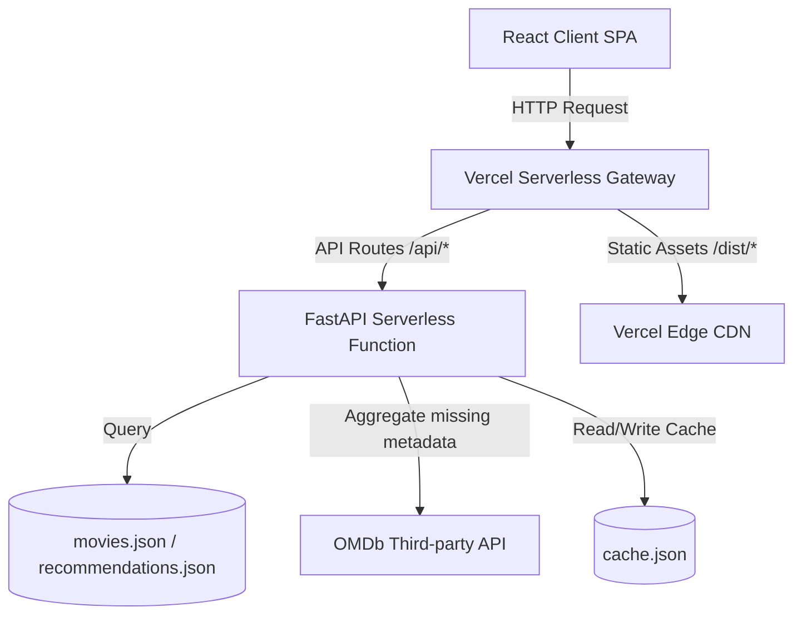

# 🎬 Cineverse Recommender

Cineverse is a modern, high-performance, and beautifully designed movie search and recommendation engine. It curates custom film recommendations using content-based machine learning algorithms.

Built with a **FastAPI** backend and a **React + Vite** frontend, Cineverse calculates metadata-based vector similarities to instantly match search queries and profiles. In production, it leverages a smart precomputed lookup system to bypass Vercel's serverless size constraints, offering sub-millisecond query responses.

---

## 🌟 Key Features

*   **Content-Based Recommendations**: Recommends movies by calculating exact vector affinities based on title, genres, release year, and descriptive tags.
*   **Dynamic Discover Console**: Filter the movie catalog interactively by selecting specific genres, restricting release year ranges, and establishing minimum IMDb rating thresholds.
*   **Instant Live Search & Autocomplete**: Prefix-matching query execution provides suggestions in real-time as you type.
*   **Personalization & Offline Persistency**: Track movie watchlists and submit custom reviews, securely persisted on the client side using browser Local Storage.
*   **Analytics Dashboard**: Clean, responsive visualizations detailing user history, including genre distribution, rating distributions, and average ratings across watchlists.
*   **Premium Glassmorphism Design**: Responsive visual layout built with modern CSS tokens, custom SVG icons, smooth transition states, skeleton loaders, and a fully polished dark theme.

---

## 🛠️ Technology Stack

### Frontend (Client SPA)
*   **Core**: React 18, JavaScript (ES6+)
*   **Build Tool**: Vite (for ultra-fast development builds and compilation)
*   **Styling**: Vanilla CSS (CSS Variables, Flexbox, CSS Grid, Glassmorphic effects, responsive layout designs)
*   **Persistency**: HTML5 Local Storage API

### Backend (Server API)
*   **API Framework**: FastAPI (Asynchronous Python framework)
*   **ASGI Server**: Uvicorn (local development)
*   **Serverless Platform**: Vercel Serverless Functions (Python runtime)
*   **HTTP Client**: Requests (with `urllib3` retry adapters for OMDb metadata aggregation)

---

## 🤖 AI & Machine Learning Pipeline

Cineverse utilizes a **Content-Based Vector Space Model** to match user tastes with relevant films:

```
[Movie Metadata] ➔ [Feature Tags (Title, Genre, Year)] ➔ [TF-IDF Vectorizer] ➔ [Cosine Similarity] ➔ [Top Recommendations]
```

### 1. Feature Representation (TF-IDF)
For each movie in the corpus, we build a textual representation string by extracting and repeating metadata fields to prioritize genres over release years:
$$\text{Tags} = \text{Normalized Title} + \text{" "} + \text{Genres} + \text{" "} + \text{Genres} + \text{" "} + \text{Release Year}$$

We apply a **Term Frequency-Inverse Document Frequency (TF-IDF)** vectorizer with $n$-gram ranges of $(1, 2)$ to convert these unstructured strings into high-dimensional sparse numerical vectors. This mathematical transformation assigns higher weights to rare genres and distinct title words, discounting common generic terms.

### 2. Cosine Similarity Measurement
The similarity between two movie vectors $\vec{u}$ and $\vec{v}$ is evaluated using the cosine of the angle between them:
$$\text{Similarity}(\vec{u}, \vec{v}) = \cos(\theta) = \frac{\vec{u} \cdot \vec{v}}{\|\vec{u}\| \|\vec{v}\|}$$

We compute a linear kernel between the target movie's vector and all other vectors in the database, sorting them descending by similarity score.

### 3. Serverless Size Optimization (Precomputation)
Vercel enforces a strict **250 MB** size limit on Python Serverless Function archives. Standard scientific computing libraries like `numpy`, `pandas`, `scipy`, and `scikit-learn` combine to exceed **400 MB**, failing standard deployments.

To solve this, Cineverse uses a hybrid architecture:
*   **Build-time Precomputation** ([precompute.py](file:///c:/Users/devap/Documents/Movie%20recommendation/backend/precompute.py)): We run the TF-IDF and Cosine Similarity computations locally once. This compiles all 27,278 movies into a structured [movies.json](file:///c:/Users/devap/Documents/Movie%20recommendation/backend/movies.json) metadata file and precalculates the top 30 recommendations for every movie into [recommendations.json](file:///c:/Users/devap/Documents/Movie%20recommendation/backend/recommendations.json).
*   **Production Serverless Runtime**: The backend imports zero scientific libraries. It reads the precompiled JSON files on startup and executes search, filtering, and recommendation retrievals via highly optimized, O(1) Python dictionary lookups. This slashes the backend size from **513 MB to under 20 MB** and speeds up request responses to sub-milliseconds.

---

## 🏛️ System Architecture

Cineverse operates as a decoupled single-page application communicating with an asynchronous serverless API:



*   **Caching Layer**: Standard movie credits and poster URLs are retrieved dynamically from the external OMDb API. These responses are written to a localized caching file [cache.json](file:///c:/Users/devap/Documents/Movie%20recommendation/backend/cache.json) to minimize API latency and request overhead on subsequent visits.

---

## 📁 Repository Structure

```
├── backend/                  # Python backend resources
│   ├── main.py               # Optimized FastAPI routes & JSON query logic
│   ├── precompute.py         # Local machine TF-IDF & similarity generator
│   ├── cache.json            # Localized OMDb cache file
│   ├── movies.json           # [Precomputed] Serialized movie list database
│   ├── recommendations.json  # [Precomputed] Top-30 recommendation dictionary
│   └── requirements.txt      # Lightweight runtime package configurations
├── frontend-vite/            # React + Vite Single Page Application
│   ├── src/
│   │   ├── components/       # Header, Footer, MovieCard, SkeletonLoader
│   │   ├── pages/            # Home, MovieDetails, Discover, Watchlist, Analytics
│   │   ├── App.jsx           # App shell and routing configuration
│   │   └── main.jsx          # Vite React entry point
│   ├── package.json          # Node dependencies & compilation scripts
│   └── vite.config.js        # Vite compiler configurations
├── api/                      # Vercel Serverless Function entry point
│   └── index.py              # Handler importing backend FastAPI application
├── data/                     # Raw dataset files (used during precomputation)
│   ├── movies.csv            # Movie database source (from GroupLens)
│   └── links.csv             # Movie-to-IMDb identifier mappings
├── vercel.json               # Vercel edge routes & deployment settings
├── package.json              # Root-level Vercel build trigger script
├── requirements.txt          # Root-level Vercel Python environment packages
└── README.md                 # Project documentation
```

---

## 🚀 Running Locally

### 1. Backend Server Setup
Ensure Python 3.9+ is installed on your system.

```bash
# Navigate to the backend directory
cd backend

# Create a virtual environment
python -m venv .venv

# Activate the virtual environment
# On Linux/macOS:
source .venv/bin/activate
# On Windows:
.venv\Scripts\activate

# Install Python requirements
pip install -r requirements.txt

# (Optional) Recompute recommendations if dataset changes:
python precompute.py

# Launch the FastAPI dev server
uvicorn main:app --reload --port 8000
```
The API documentation will be interactive at [http://127.0.0.1:8000/docs](http://127.0.0.1:8000/docs).

### 2. Frontend SPA Setup
Ensure Node.js is installed.

```bash
# Navigate to the frontend directory
cd frontend-vite

# Install npm dependencies
npm install

# Launch Vite development server
npm run dev
```
The client application will run on [http://localhost:5173/](http://localhost:5173/).

---

## ☁️ Deploying to Vercel

Cineverse is fully configured for Vercel edge deployment:

1. Push your updated code to GitHub.
2. Link your repository in the **Vercel Dashboard**.
3. Choose the project configuration settings:
    *   **Framework Preset**: Select `Other` (do **NOT** select `FastAPI` or `Vite` to ensure both Python serverless and React builds are triggered by the root configuration).
    *   **Build Command**: Stays disabled/default (Vercel automatically triggers the root `package.json` build script).
    *   **Output Directory**: Stays disabled/default (Vercel automatically redirects to `dist` as specified in `vercel.json`).
4. Click **Deploy**. Vercel will build the frontend assets, set up the static routing, and package the FastAPI serverless function.

---

## 🤝 Connect with the Developer

For collaborations, feedback, or custom inquiries:

*   **GitHub**: [devaprasathk28-dot](https://github.com/devaprasathk28-dot)
*   **LinkedIn**: [K Devaprasath](https://www.linkedin.com/in/k-devaprasath-a5079332b)

---
*Created by Devaprasath. © 2026 Cineverse Recommender.*

