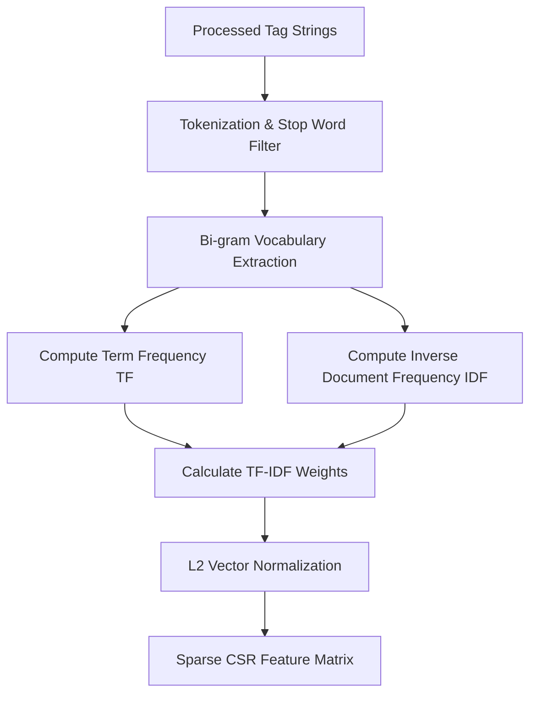
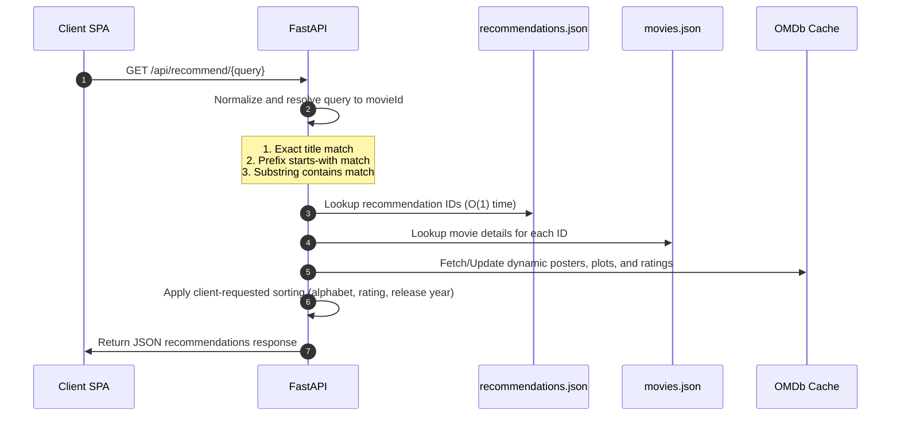
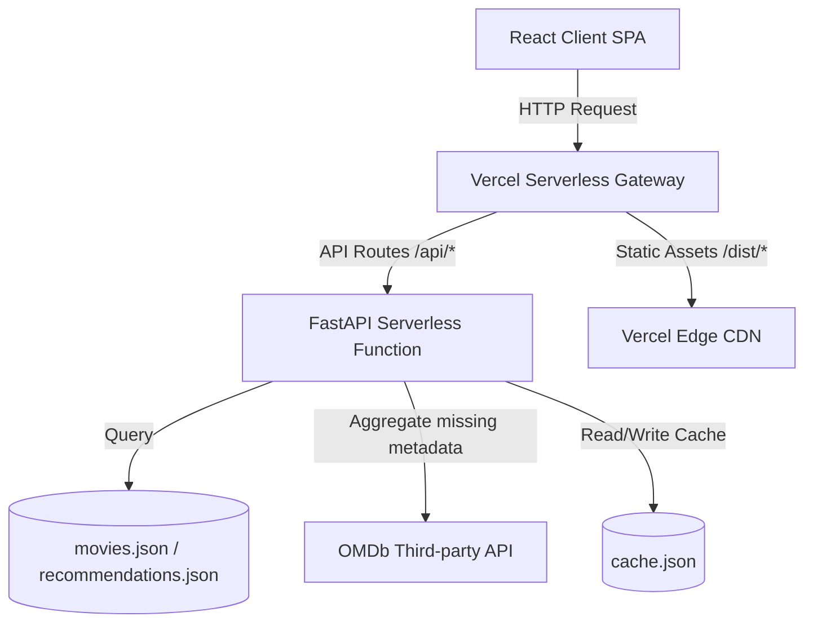

# 🎬 Cineverse Recommender

Cineverse is a modern, high-performance, and beautifully designed movie search and recommendation engine. It curates custom film recommendations using content-based machine learning algorithms.

Built with a **FastAPI** backend and a **React + Vite** frontend, Cineverse calculates metadata-based vector similarities to instantly match search queries and profiles. In production, it leverages a smart precomputed lookup system to bypass Vercel's serverless size constraints, offering sub-millisecond query responses.

---

## 🌟 Key Features

*   **Content-Based Recommendations**: Recommends movies by calculating exact vector affinities based on title, genres, release year, and descriptive tags.
*   **Dynamic Discover Console**: Filter the movie catalog interactively by selecting specific genres, restricting release year ranges, and establishing minimum IMDb rating thresholds.
*   **Instant Live Search & Autocomplete**: Prefix-matching query execution provides suggestions in real-time as you type.
*   **Personalization & Offline Persistency**: Track movie watchlists and submit custom reviews, securely persisted on the client side using browser Local Storage.
*   **Analytics Dashboard**: Clean, responsive visualizations detailing user history, including genre distribution, rating distributions, and average ratings across watchlists.
*   **Premium Glassmorphism Design**: Responsive visual layout built with modern CSS tokens, custom SVG icons, smooth transition states, skeleton loaders, and a fully polished dark theme.

---

## 🛠️ Technology Stack

### Frontend (Client SPA)
*   **Core**: React 18, JavaScript (ES6+)
*   **Build Tool**: Vite (for ultra-fast development builds and compilation)
*   **Styling**: Vanilla CSS (CSS Variables, Flexbox, CSS Grid, Glassmorphic effects, responsive layout designs)
*   **Persistency**: HTML5 Local Storage API

### Backend (Server API)
*   **API Framework**: FastAPI (Asynchronous Python framework)
*   **ASGI Server**: Uvicorn (local development)
*   **Serverless Platform**: Vercel Serverless Functions (Python runtime)
*   **HTTP Client**: Requests (with `urllib3` retry adapters for OMDb metadata aggregation)

---

## 🤖 AI & Machine Learning Architecture & Flow

Cineverse utilizes a **Content-Based Vector Space Model (VSM)** to analyze, represent, and recommend movies. To ensure compliance with Vercel's serverless size limits, the execution flow is divided into an **Offline Build-Time Precomputation Phase** and a **Runtime Serverless Inference Phase**.

```
+---------------------------------------------------------------------------------+
|                       OFFLINE BUILD-TIME PRECOMPUTATION                         |
|                                                                                 |
|  [Raw CSVs] ➔ [Tag Preparation] ➔ [TF-IDF Vectorization] ➔ [Similarity Matrix]  |
|                                         │                                       |
|                                         ▼                                       |
|                         [movies.json] + [recommendations.json]                  |
+---------------------------------------------------------------------------------+
                                          │
                                          ▼
+---------------------------------------------------------------------------------+
|                          RUNTIME SERVERLESS INFERENCE                           |
|                                                                                 |
|  [Search Query] ➔ [O(1) JSON Lookup] ➔ [Dynamic Sorting/Filtering] ➔ [Response]  |
+---------------------------------------------------------------------------------+
```

---

### 1. Document Preprocessing & Feature Engineering
Before mathematical modeling, raw metadata from `movies.csv` and `links.csv` is parsed and sanitized:
1.  **Deduplication & Merge**: Links and movies are joined via `movieId`. We drop rows with missing IMDb identifiers and drop duplicate movies to enforce unique records.
2.  **Title Sanitization**: Movie titles are normalized using regular expressions. Parenthetical release years (e.g., `(1995)`) and special characters are stripped out, collapsing all characters to lowercase.
3.  **Genre Weight Multiplier**: To ensure recommendations are heavily influenced by genre alignment rather than just title terms or release years, the genres text (with pipes replaced by spaces) is **duplicated twice** in the tags string.
4.  **Metadata Tag Assembly**: For each movie, a raw feature tag string is constructed:
    $$\text{Tag String}_d = \text{NormalizedTitle}_d + \text{" "} + \text{Genres}_d + \text{" "} + \text{Genres}_d + \text{" "} + \text{ReleaseYear}_d$$

*Example for "Toy Story (1995)"*:
*   **Normalized Title**: `toy story`
*   **Genres**: `Adventure Animation Children Comedy Fantasy`
*   **Output Tags**: `"toy story adventure animation children comedy fantasy adventure animation children comedy fantasy 1995"`

---

### 2. Mathematical Modeling (TF-IDF Vectorization)
The unstructured text tags are converted into numerical feature vectors in a sparse vector space using the **Term Frequency-Inverse Document Frequency (TF-IDF)** framework. 



#### Step A: Tokenization & Vocabulary Construction
*   We use a `TfidfVectorizer` that ignores standard English stop words (like "the", "and", "is") which contain no movie search value.
*   **N-gram Range**: Set to $(1, 2)$, meaning we extract both unigrams (single words like `"story"`) and bigrams (consecutive word pairs like `"toy story"`). This captures phrases and compound genres.
*   The vocabulary represents all unique tokens extracted from the corpus. Let $V$ be the size of the vocabulary.

#### Step B: Term Frequency (TF)
For a token $t$ in a movie's tag document $d$:
$$\text{TF}(t, d) = \frac{\text{Count}(t \text{ in } d)}{\text{Total tokens in } d}$$

#### Step C: Inverse Document Frequency (IDF)
To penalize extremely common words that appear in many documents (e.g., "comedy" or "action") and highlight distinctive keywords, the inverse document frequency is computed as:
$$\text{IDF}(t) = \log \left( \frac{1 + N}{1 + \text{DF}(t)} \right) + 1$$
*   Where $N$ is the total number of movies in the corpus ($27,278$).
*   $\text{DF}(t)$ is the document frequency: the number of movies containing token $t$.
*   The constants ($1$) prevent division-by-zero errors for out-of-vocabulary terms and ensure non-negative weights.

#### Step D: TF-IDF Weight Calculation
The raw weight for token $t$ in movie $d$ is:
$$\text{Raw Weight}(t, d) = \text{TF}(t, d) \times \text{IDF}(t)$$

#### Step E: Vector Normalization
To prevent longer titles or multiple genres from skewing the similarity metrics, we apply **$L_2$ (Euclidean) Normalization** to scale each movie's vector $\vec{v}_d$ to unit length:
$$\vec{v}_d = \frac{\vec{v}_d}{\|\vec{v}_d\|_2} = \frac{\vec{v}_d}{\sqrt{\sum_{i=1}^{V} \text{Raw Weight}(t_i, d)^2}}$$

The resulting vector space is stored as a compressed sparse row (CSR) matrix of dimensions $27,278 \times V$.

---

### 3. Cosine Similarity Measurement
The recommendation engine measures the similarity between two movie vectors $\vec{u}$ and $\vec{v}$ by computing the cosine of the angle between them. Since our vectors are $L_2$ normalized, this equals their dot product:
$$\text{Similarity}(\vec{u}, \vec{v}) = \cos(\theta) = \frac{\vec{u} \cdot \vec{v}}{\|\vec{u}\|_2 \|\vec{v}\|_2} = \sum_{i=1}^{V} u_i \cdot v_i$$

For any target movie, we compute a linear kernel between its vector and the entire matrix to generate a similarity score array of size $27,278$.

To eliminate duplicates during this process:
1.  Candidates are sorted in descending order of similarity.
2.  Self-similarity (score of 1.0 against itself) is filtered.
3.  We track candidate `imdbId` and `normalized_title` to skip duplicates (such as remakes or duplicate listings) and retrieve the top 30 most similar, distinct movies.

---

### 4. Build-Time Precomputation vs. Serverless Runtime Flow
To satisfy Vercel's **250 MB size limit** for serverless function ZIPs, the dependencies `numpy`, `pandas`, `scipy`, and `scikit-learn` (which total over 400 MB) are used exclusively **locally during the build-time precomputation phase** and are omitted entirely from production serverless execution.

#### Offline Precomputation Flow (Local Dev)
1.  Run [precompute.py](file:///c:/Users/devap/Documents/Movie%20recommendation/backend/precompute.py).
2.  Load local datasets `movies.csv` and `links.csv`.
3.  Run TF-IDF and calculate the pairwise cosine similarity for all movies.
4.  Write metadata to [movies.json](file:///c:/Users/devap/Documents/Movie%20recommendation/backend/movies.json).
5.  Write the similarity relationships map (`movieId` ➔ list of 30 recommended `movieIds`) to [recommendations.json](file:///c:/Users/devap/Documents/Movie%20recommendation/backend/recommendations.json).
6.  Commit the JSON files to Git.

#### Online Inference Flow (Vercel Serverless Function)


This decoupled architecture achieves **sub-millisecond lookups** in production, requires **less than 20 MB** of dependencies, and runs serverlessly on Vercel without package size conflicts.

---

## 🏛️ System Architecture

Cineverse operates as a decoupled single-page application communicating with an asynchronous serverless API:



*   **Caching Layer**: Standard movie credits and poster URLs are retrieved dynamically from the external OMDb API. These responses are written to a localized caching file [cache.json](file:///c:/Users/devap/Documents/Movie%20recommendation/backend/cache.json) to minimize API latency and request overhead on subsequent visits.

---

## 📁 Repository Structure

```
├── backend/                  # Python backend resources
│   ├── main.py               # Optimized FastAPI routes & JSON query logic
│   ├── precompute.py         # Local machine TF-IDF & similarity generator
│   ├── cache.json            # Localized OMDb cache file
│   ├── movies.json           # [Precomputed] Serialized movie list database
│   ├── recommendations.json  # [Precomputed] Top-30 recommendation dictionary
│   └── requirements.txt      # Lightweight runtime package configurations
├── frontend-vite/            # React + Vite Single Page Application
│   ├── src/
│   │   ├── components/       # Header, Footer, MovieCard, SkeletonLoader
│   │   ├── pages/            # Home, MovieDetails, Discover, Watchlist, Analytics
│   │   ├── App.jsx           # App shell and routing configuration
│   │   └── main.jsx          # Vite React entry point
│   ├── package.json          # Node dependencies & compilation scripts
│   └── vite.config.js        # Vite compiler configurations
├── api/                      # Vercel Serverless Function entry point
│   └── index.py              # Handler importing backend FastAPI application
├── data/                     # Raw dataset files (used during precomputation)
│   ├── movies.csv            # Movie database source (from GroupLens)
│   └── links.csv             # Movie-to-IMDb identifier mappings
├── vercel.json               # Vercel edge routes & deployment settings
├── package.json              # Root-level Vercel build trigger script
├── requirements.txt          # Root-level Vercel Python environment packages
└── README.md                 # Project documentation
```

---

## 🚀 Running Locally

### 1. Backend Server Setup
Ensure Python 3.9+ is installed on your system.

```bash
# Navigate to the backend directory
cd backend

# Create a virtual environment
python -m venv .venv

# Activate the virtual environment
# On Linux/macOS:
source .venv/bin/activate
# On Windows:
.venv\Scripts\activate

# Install Python requirements
pip install -r requirements.txt

# (Optional) Recompute recommendations if dataset changes:
python precompute.py

# Launch the FastAPI dev server
uvicorn main:app --reload --port 8000
```
The API documentation will be interactive at [http://127.0.0.1:8000/docs](http://127.0.0.1:8000/docs).

### 2. Frontend SPA Setup
Ensure Node.js is installed.

```bash
# Navigate to the frontend directory
cd frontend-vite

# Install npm dependencies
npm install

# Launch Vite development server
npm run dev
```
The client application will run on [http://localhost:5173/](http://localhost:5173/).

---

## ☁️ Deploying to Vercel

Cineverse is fully configured for Vercel edge deployment:

1. Push your updated code to GitHub.
2. Link your repository in the **Vercel Dashboard**.
3. Choose the project configuration settings:
    *   **Framework Preset**: Select `Other` (do **NOT** select `FastAPI` or `Vite` to ensure both Python serverless and React builds are triggered by the root configuration).
    *   **Build Command**: Stays disabled/default (Vercel automatically triggers the root `package.json` build script).
    *   **Output Directory**: Stays disabled/default (Vercel automatically redirects to `dist` as specified in `vercel.json`).
4. Click **Deploy**. Vercel will build the frontend assets, set up the static routing, and package the FastAPI serverless function.

---

## 🤝 Connect with the Developer

For collaborations, feedback, or custom inquiries:

*   **GitHub**: [devaprasathk28-dot](https://github.com/devaprasathk28-dot)
*   **LinkedIn**: [K Devaprasath](https://www.linkedin.com/in/k-devaprasath-a5079332b)

---
*Created by Devaprasath. © 2026 Cineverse Recommender.*

